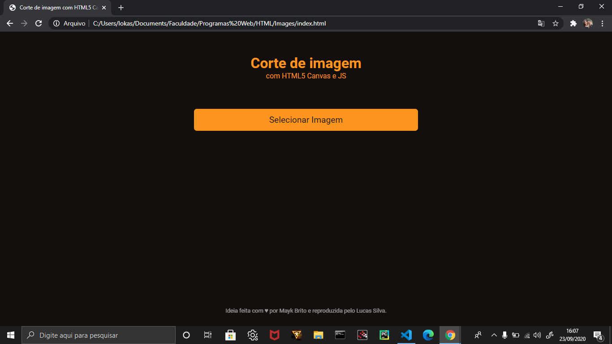
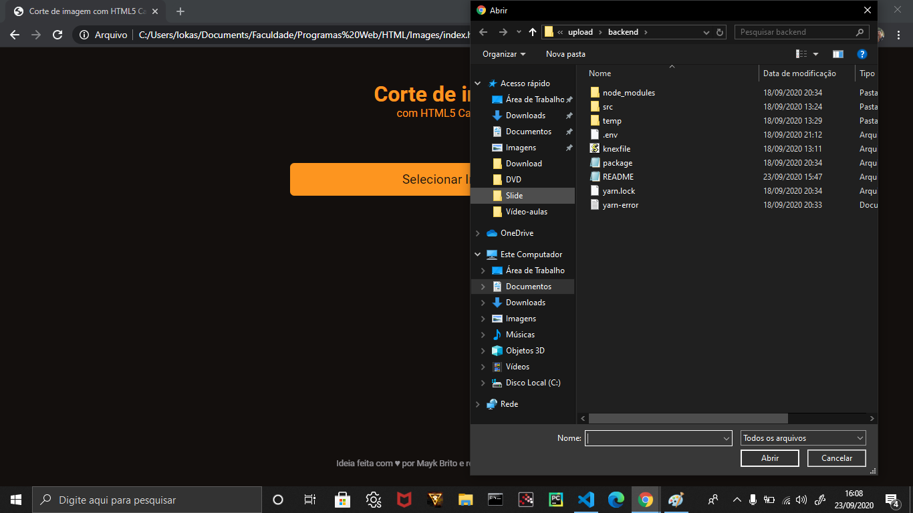
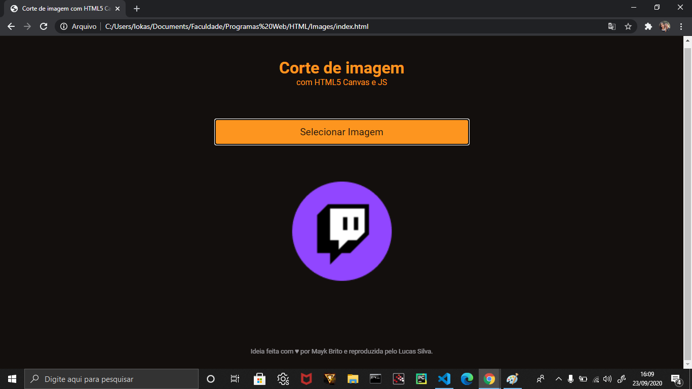
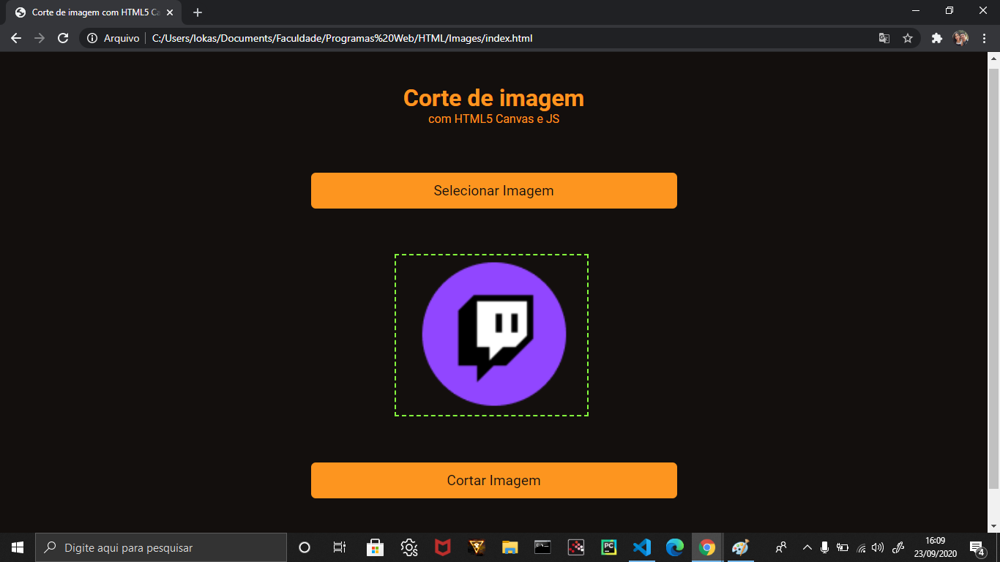
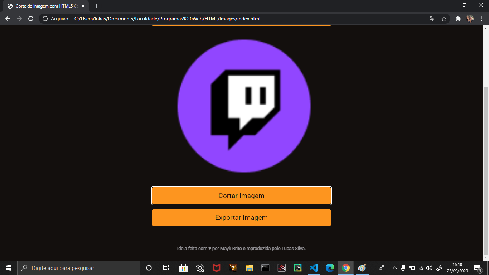
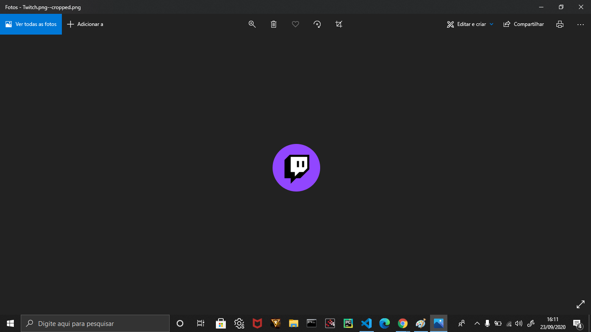

# Image Crop :camera: :scissors: :computer:

## Este projeto é uma retomada dos estudos sobre HTML, Css e Javascript.
## Foco do projeto: Selecionar uma imagem no computador do usuário, fazer um corte na região desejada e salvar no pc.

## Os arquivos index.html e style.css são responsáveis pela estrutura e estilização do projeto, enquanto o arquivo scripts.js é o real responsável pela dinâmica. O desing inicial do projeto entá representado na imagem a baixo:

## Ao selecionar a imagem para o corte, o projeto ficará assim:

# scripts.js:
### Nota: As palavras com "" indicam as regiões do arquivo de explicação.

## "Contantes" são os const que selecionam os elementos da interface a serem modificados.
### PhotoFile está vinculado à imagem de entrada.
### seleção leva o elemento responsável por marcar a região do corte.
### cropButton faz as modificações e implementações do botão de corte.
### downloadButton é um botão que salva a imagem recortada no computador.

## "Variáveis" é o conjunto de variáveis que tiveram seus valores modificados ao longo do processo, tendo a responsabilidade de realizar as principais alterações na funcionalidade do projeto.
### PhotoPreview responsável por reproduzir a imagem na região selecionada pelo usuário.
### image recebe new Image(), isso para evitar o bug de caso troque de imagem.
### photoName recebe o nome original da imagem selecionada e adiciona '--cropped.png' para nomear a nova imagem.
### startX, startY, relativeStartX, relativeStartY, endX, endY, relativeEndX, relativeEndY são responsáveis por armazenar a posição do mouse e modelar a área de seleção de corte, representado na imagem a seguir: 

### startselection serve para 'controlar' a área de corte.
### canvas é a variável mais importante, pois fará os cortes da imagem selecionada e o ctx contém as configurações.

## "Funcionalidade":
### window.addEventListener adiciona o evento para carregar a imagem selecionada pelo usuário. Ela também é responsável por abrir a tela de pesquisa mostrada na imagem 2. Além disso, desempenha a função responsável pela magia do projeto.

## "Eventos" é responsável por armazenar os principais eventos do projeto e sua dinâmica.
### mouseover é acionado quando o mouse está sobre a imagem, para modificar o estilo do cursor.
### mousedown coleta a posição absoluta e relativa do mouse ao clicar na imagem, além de permitir o início da área tracejada do corte.
### mousemove calcula a posição do mouse para expandir a caixa de corte seguindo o movimento.
### mouseup assume a posição quando o usuário para de pressionar o botão do mouse.

## "ObjectKey" executa os eventos.

## "OnloadImage" faz o corte na imagem e reproduz o corte na região de pré-visualização.

## "Corte" faz o serviço mais importante desse projeto, o Corte.
### As primeiras duas const pegam os tamanhos da imagem principal e da pré-visualização. A segunda const faz a relação com o tamanho absoluto e relativo, isso faz com que o corte da imagem seja preciso.
### O const croppedImage faz o corte e limpeza antes de salvar.
## downloadButton faz o serviço de salvar a imagem recortada no PC.

# E FIM:

